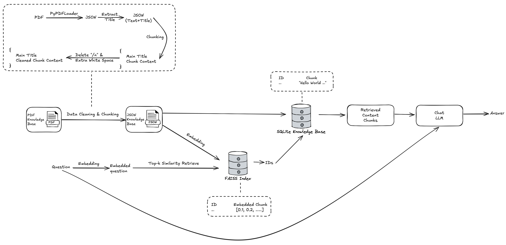

# SQLite-FAISS-RAG


## Overview

This workflow consists of the following steps:

1. **Preprocess PDF Files**: Load, clean, and split PDF files into text chunks.
2. **Build Index**: Generate embeddings for text chunks, build a FAISS index, and store data in a SQLite database.
3. **Search Index**: Retrieve the most similar text chunks based on a query.



## Directory Structure

```
.
├── config.py  
├── main.py  
├── preprocess_pdfs.py  
├── build_index.py  
├── search_index.py  
├── requirements.txt  
└── README.md  
```

## Installation

### 1. Install Dependencies

```bash
pip install numpy faiss-cpu langchain-community pypdf sentence_transformers tqdm
```

> **Note**: If you have a GPU and wish to use GPU acceleration, install `faiss-gpu` instead of `faiss-cpu`.

### 2. Configure Parameters

Before running the workflow, edit the `config_SQLite_FAISS_RAG.py` file to set parameters according to your needs:

```python
# config.py

# Path settings  
input_folder = "PDF_input"      # Folder containing PDF files  
output_folder = "PDF_output"    # Folder to save processed JSON files  

json_folder_path = output_folder  # Use the output folder from the previous step  
db_path = "chunks.db"             # Path to the SQLite database  
index_path = "faiss.index"        # Path to the FAISS index  

# Text splitting parameters  
chunk_size = 1200  
chunk_overlap = 400  

# Embedding model parameters  
embedding_model_name = 'BAAI/bge-base-en-v1.5'  # Change to your desired model  
device = 'cpu'  # Options are 'cpu', 'cuda', 'mps', etc.  

# Batch size  
batch_size = 500  # Adjust based on your system's memory  

# Query parameters  
query = "Your query content"  
top_k = 5  
```

## Usage Steps

### Step 1: Preprocess PDF Files

Run the following command to preprocess PDF files:

```bash
python preprocess_pdfs.py
```

This script will:

- Load PDF files from the `input_folder`.
- Clean the text (remove references, merge hyphenated words, etc.).
- Split the text into chunks based on `chunk_size` and `chunk_overlap`.
- Save the processed chunks as JSON files in the `output_folder`.

### Step 2: Build FAISS Index

Generate embeddings for the text chunks and build a FAISS index:

```bash
python build_index.py
```

This script will:

- Load the text chunks from JSON files in `json_folder_path`.
- Generate embeddings using the specified embedding model.
- Store the text chunks and metadata in a SQLite database at `db_path`.
- Build a FAISS index and save it to `index_path`.

### Step 3: Search the Index

Search for the most similar text chunks based on a query:

```bash
python search_index.py
```

This script will:

- Generate an embedding for the query text.
- Use the FAISS index to find the top `top_k` most similar text chunks.
- Retrieve the corresponding text chunks from the SQLite database.
- Display the results.

### Alternative: Run the Entire Workflow

You can run the entire workflow sequentially using the `main_SQLite_FAISS_RAG.py` script:

```bash
python main_SQLite_FAISS_RAG.py
```

This script will execute all three steps in order.

## Configuration

You can customize the workflow by modifying the `config.py` file:

- **Path Settings**:  
  - `input_folder`: Path to the folder containing the PDF files to process.  
  - `output_folder`: Path to the folder where the processed JSON files will be saved.  
  - `db_path`: Path to the SQLite database file.  
  - `index_path`: Path to the FAISS index file.  
- **Text Splitting Parameters**:  
  - `chunk_size`: Maximum number of characters per text chunk.  
  - `chunk_overlap`: Number of overlapping characters between text chunks.  
- **Embedding Model Parameters**:  
  - `embedding_model_name`: Name of the embedding model to use (e.g., 'BAAI/bge-base-en-v1.5').  
  - `device`: Compute device to use ('cpu', 'cuda', 'mps', etc.).  
- **Batch Size**:  
  - `batch_size`: Batch size for embedding generation. Adjust based on your system's memory.  
- **Query Parameters**:  
  - `query`: The query text to search for in the index.  
  - `top_k`: The number of top similar results to retrieve.  

## Example Output

```bash
(rag1) tanqiwen@tanqiwendebijibendiannao-2 SQLite-FAISS-RAG % /Users/tanqiwen/Documents/rag1/bin/python /Users/tanqiwen/Documents/SQLite-FAISS-RAG/main_SQLite_FAISS_RAG.py
Step 1: Preprocessing PDFs...
Processing PDFs: 100%|███████████████████████████████████████████████████████████████████████████████████████████████████████████████████████████| 1/1 [00:00<00:00,  1.33it/s]
Step 2: Building FAISS index...
Total number of files to process: 1
Processing JSON files: 100%|███████████████████████████████████████████████████████████████████████████████████████████████████████████████████| 1/1 [00:00<00:00, 1615.06it/s]
Processed 133 records (completed)
FAISS index saved to faiss.index
Step 3: Searching the index...
Retrieving data: 100%|████████████████████████████████████████████████████████████████████████████████████████████████████████████████████████| 5/5 [00:00<00:00, 33554.43it/s]
Result 1:
Title: PaLM: Scaling Language Modeling with Pathways
Content: “2 is an odd integer.”). From analyzing several examples of this task, it seems that all PaLM models (and the human asked to solve the task) have difficulty in cases where the assumption is incorrect, even though the instructions state that the correctness of the assumption is irrelevant. In Figure 6 we show the distribution of improvement over tasks, when comparing PaLM 540B to the average performance score of human evaluations. We can see that although PaLM 540B outperforms the average human performance on aggregate, the average human performance is still higher than PaLM 540B on 35% of the individual tasks (see examples in Table 43 in the appendix). This indicates that there is still significant room for improvement on BIG-bench. We consider several tasks where PaLM 540B performance exceeds the average human performance (see detailed results in Table 42 in the appendix). We observe that few of these tasks exhibit PaLM’s ability to perform well across many languages, for example, persian idioms and swedish togerman proverbs , where the pool of humans who evaluated these tasks may not be well-versed in all languages. One of
--------------------------------------------------------------------------------
Result 2:
Title: PaLM: Scaling Language Modeling with Pathways
Content: available on OpenAI’s API, which are not evaluated here. 14 performance. Figure 3-right presents PaLM results on the BIG-bench textual task collection (150 tasks), which has similar performance characteristics. 10810910101011 Model Parameters (Non-Embedding)020406080Normalized Preferred Metric (Avg.) Performance on 58 Tasks Gopher 5-shot Chinchilla 5-shot GPT-3 0-shot GPT-3 1-shot PaLM 0-shot PaLM 1-shot PaLM 5-shot Human (Avg.) Human (Best) 10101011 Model Parameters (Non-Embedding)01020304050607080Normalized Preferred Metric (Avg.) Performance on 150 Tasks PaLM 0-shot PaLM 1-shot PaLM 5-shot Human (Avg.) Human (Best) Figure 3: BIG-bench evaluation of PaLM. (left) Evaluation of PaLM, GPT-3, Gopher, and Chinchilla. Previous models have only evaluated on a subset of tasks, so this graph shows aggregate results on the 58 tasks which all three models have evaluated on. (right) Evaluation of PaLM on a larger set of 150 BIG-bench tasks. For each task, the results of its preferred metric are used. The results are normalized by setting the maximum score to 100 and the random chance score to 0 for multiple-choice tasks, so that they are negative
--------------------------------------------------------------------------------
Result 3:
Title: PaLM: Scaling Language Modeling with Pathways
Content: PaLM: Scaling Language Modeling with Pathways Aakanksha Chowdhery∗Sharan Narang∗Jacob Devlin∗ Maarten Bosma Gaurav Mishra Adam Roberts Paul Barham Hyung Won Chung Charles Sutton Sebastian Gehrmann Parker Schuh Kensen Shi Sasha Tsvyashchenko Joshua Maynez Abhishek Rao†Parker Barnes Yi Tay Noam Shazeer‡Vinodkumar Prabhakaran Emily Reif Nan Du Ben Hutchinson Reiner Pope James Bradbury Jacob Austin Michael Isard Guy Gur-Ari Pengcheng Yin Toju Duke Anselm Levskaya Sanjay Ghemawat Sunipa Dev Henryk Michalewski Xavier Garcia Vedant Misra Kevin Robinson Liam Fedus Denny Zhou Daphne Ippolito David Luan‡Hyeontaek Lim Barret Zoph Alexander Spiridonov Ryan Sepassi David Dohan Shivani Agrawal Mark Omernick Andrew M. Dai Thanumalayan Sankaranarayana Pillai Marie Pellat Aitor Lewkowycz Erica Moreira Rewon Child Oleksandr Polozov†Katherine Lee Zongwei Zhou Xuezhi Wang Brennan Saeta Mark Diaz Orhan Firat Michele Catasta†Jason Wei Kathy Meier-Hellstern Douglas Eck Jeff Dean Slav Petrov Noah Fiedel Google Research Abstract Large language models have been shown to achieve remarkable performance across a variety of natural
--------------------------------------------------------------------------------
Result 4:
Title: PaLM: Scaling Language Modeling with Pathways
Content: We consider several tasks where PaLM 540B performance exceeds the average human performance (see detailed results in Table 42 in the appendix). We observe that few of these tasks exhibit PaLM’s ability to perform well across many languages, for example, persian idioms and swedish togerman proverbs , where the pool of humans who evaluated these tasks may not be well-versed in all languages. One of the tasks, periodic elements , is memorization-heavy, thereby leveraging memorization capability of large language models. Most other tasks, such as common morpheme ,sufficient information , and logical args , emphasize impressive natural language processing capabilities of PaLM 540B. To illustrate this point further, we consider the cause andeffect task, which asks the model to determine which of two presented events 17 100 75 50 25 0255075100Preferred Metric DeltaPaLM 540b 5-shot vs. Human (Avg.): 150 BIG-bench Tasks PaLM 540b > Human (Avg.) Human (Avg.) > PaLM 540bFigure 6: Distribution of score difference in “normalized preferred metric” between PaLM 540B and the average human performance across all 150 BIG-bench text tasks. Positive numbers (blue) indicate that PaLM
--------------------------------------------------------------------------------
Result 5:
Title: PaLM: Scaling Language Modeling with Pathways
Content: topics such as mathematics, history and law. As shown in Table 6, PaLM 540B improves the average score of MMLU benchmark by ≈2 points. PaLM 540B outperforms the Chinchilla model on all the categories except the category for Other tasks. Model Average Humanities STEM Social Sciences Other Chinchilla 70B (Prior SOTA) 67 .5 63 .6 54 .9 79 .3 73.9 PaLM 8B 25 .3 25 .6 23 .8 24 .1 27 .8 PaLM 62B 53 .7 59 .5 41 .9 62 .7 55 .8 PaLM 540B 69.3 77.0 55.6 81.0 69.6 Table 6: Results (5-shot) of Chinchilla (Hoffmann et al., 2022) and PaLM models on the MMLU (Hendrycks et al., 2021) benchmark. Chinchilla represents the prior state of the art results on this benchmark. The results are reported on the test set of each of the tasks. 6.1.2 Finetuning We conduct finetuning experiments for the PaLM model on the SuperGLUE benchmark. PaLM is finetuned with 5×10−5learning rate using the Adafactor optimizer, with a batch size of 32. PaLM converges typically in less than 15K steps of finetuning. Table 7 reports the validation results on finetuning on task-proportionate mixture of SuperGLUE tasks. On SuperGLUE, we compare with state-of-the-art models such as T5-11B (Raffel et al., 2020) and ST-MoE-32B
--------------------------------------------------------------------------------
```

## Notes

- Ensure that the `input_folder` contains the PDF files you want to process.
- Adjust the `device` and `batch_size` parameters based on your hardware configuration.  
  - If you have a GPU, set `device='cuda'` and make sure you have the necessary drivers and CUDA toolkit installed.  
- The default embedding model is 'BAAI/bge-base-en-v1.5'. You can change it to any compatible model from the Hugging Face Transformers library or Sentence Transformers.  
- The scripts assume that the PDF files are in English. If your PDFs are in another language, you may need to adjust the text cleaning and splitting functions accordingly.  